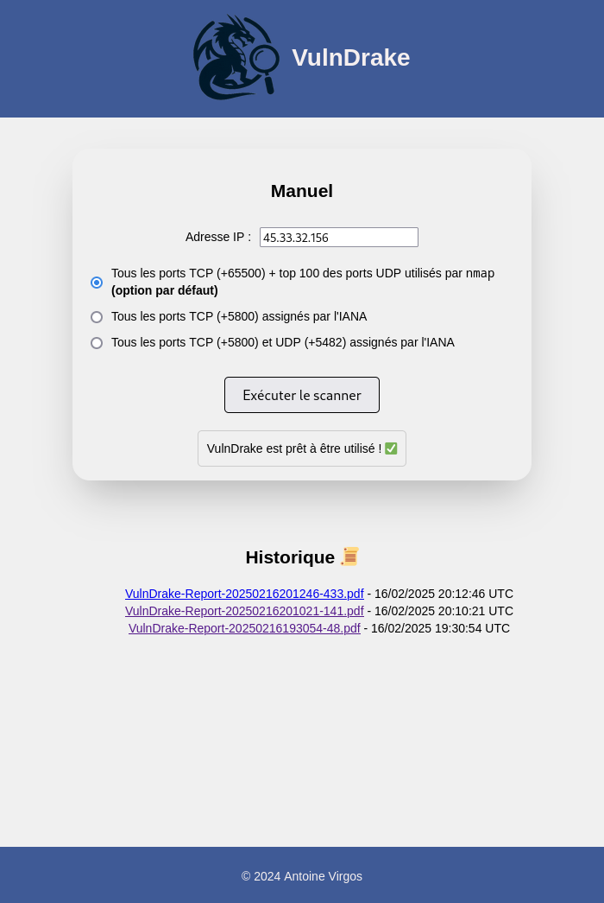

# VulnDrake


VulnDrake is a web-based vulnerability scanning and management application that integrates with OpenVAS to provide comprehensive security assessments.

## Features

ℹ️ **Configuration used : `d21f6c81-2b88-4ac1-b7b4-a2a9f2ad4663`** (*Basic configuration template with a minimum set of NVTs required for a scan. Version 20200827.*). See [the list of configurations available](https://github.com/greenbone/gvm-tools/blob/main/tests/scripts/get_scan_configs.xml).

- **Manual Scan**
    - Scan options (ports) :
        - All TCP ports (+65500) + top 100 UDP ports used by `nmap` **(default option)**.
        - All TCP ports (+5800) assigned by [IANA](https://www.iana.org).
        - All TCP (+5800) and UDP (+5482) ports assigned by [IANA](https://www.iana.org).

- **Scan History**
    - Access a history of previous scan reports.
    - Download reports in PDF format.

## Prerequisites

- [`docker`](https://docs.docker.com/engine/install/)
- [`docker-compose`](https://docs.docker.com/compose/install/linux/)

## Overview



## Usage

Deploy VulnDrake :

```bash
sudo docker compose up -d
```

Access to VulnDrake :

https://localhost

## Configuration

Renew the self-signed certificate :

```bash
cd nginx/

./renew-cert.sh
```